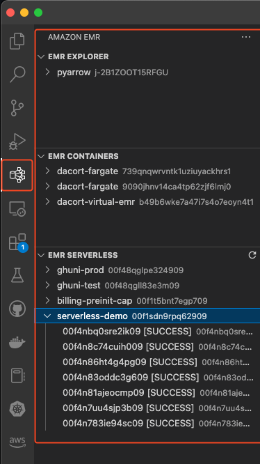
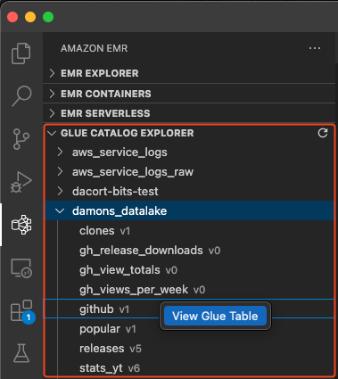
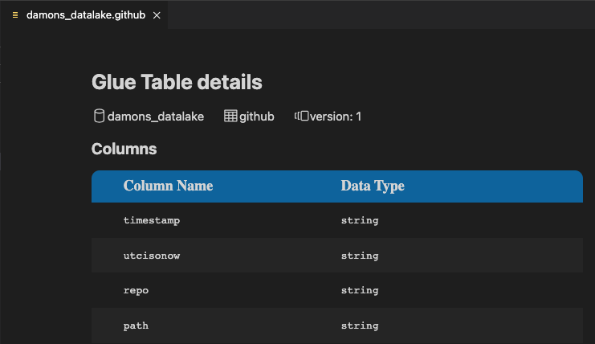
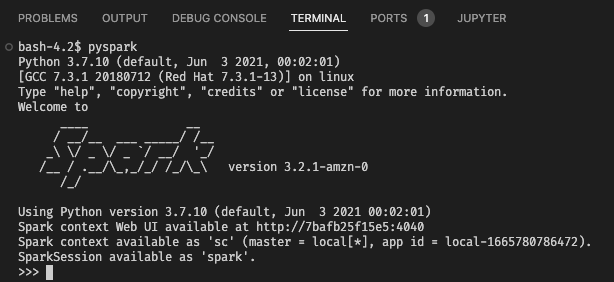

# Amazon EMR Toolkit for VS Code (Developer Preview)

EMR Toolkit is a VS Code Extension to make it easier to develop Spark jobs on EMR.

## Requirements

- A local [AWS profile](https://docs.aws.amazon.com/cli/latest/userguide/cli-configure-quickstart.html)
- Access to the AWS API to list EMR and Glue resources
- [Docker](https://docs.docker.com/install/) (if you want to use the devcontainer)

## Features

- [Amazon EMR Explorer](#amazon-emr-explorer)
- [Glue Data Catalog Explorer](#glue-catalog-explorer)
- [EMR Development Container](#pyspark-emr-development-container)
    - [Spark shell support](#spark-shell-support)
    - [Jupyter Notebook support](#jupyter-notebook-support)
- [EMR Serverless Deployment](#emr-serverless-deployment)

### Amazon EMR Explorer

The Amazon EMR Explorer allows you to browse job runs and steps across EMR on EC2, EMR on EKS, and EMR Serverless. To see the Explorer, choose the EMR icon in the Activity bar.



### Glue Catalog Explorer

The Glue Catalog Explorer displays databases and tables in the Glue Data Catalog. By right-clicking on a table, you can select `View Glue Table` that will show the table columns.





### PySpark EMR Development Container

The toolkit provides an `EMR: Create local Spark environment` command that creates a [development container](https://code.visualstudio.com/docs/remote/containers) based off of an EMR on EKS image for the EMR version you choose. This container can be used to develop Spark and PySpark code locally that is fully compatible with your remote EMR environment.

You choose a region and EMR version you want to use, and the extension creates the relevant `Dockerfile` and `devcontainer.json`.

Once the container is created, follow the instructions in the `emr-local.md` file to authenticate to ECR and use the `Dev--Containers: Reopen in Container` command to build and open your local Spark environment.

You can choose to configure AWS authentication in the container in 1 of 3 ways:

- **Use existing ~/.aws config** - This mounts your ~/.aws directory to the container.
- **Environment variables** - If you already have [AWS environment variables](https://docs.aws.amazon.com/cli/latest/userguide/cli-configure-envvars.html) configured in your shell, the container will reference those variables.
- **.env file** - Creates a `.devcontainer/aws.env` file that you can populate with AWS credentials.

#### Spark Shell Support

The EMR Development Container is configured to run Spark in local mode. You can use it like any Spark-enabled environment. Inside the VS Code Terminal, you can use the `pyspark` or `spark-shell` commands to start a local Spark session.



#### Jupyter Notebook Support

By default, the EMR Development Container also supports Jupyter. Use the **Create: New Jupyter Notebook** command to create a new Jupyter notebook. The following code snippet shows how to initialize a Spark Session inside the notebook. By default, the Container environment is also configured to use the Glue Data Catalog so you can use `spark.sql` commands against Glue tables.

```python
from pyspark.sql import SparkSession

spark = (
    SparkSession.builder.appName("EMRLocal")
    .getOrCreate()
)
```

#### EMR Serverless Deployment

You can deploy and run a single PySpark file on EMR Serverless with the **EMR Serverless: Deploy and run PySpark job** command. You'll be prompted for the following information:

- **S3 URI** - Your PySpark file will be copied here
- **IAM Role** - A [job runtime role](https://docs.aws.amazon.com/emr/latest/EMR-Serverless-UserGuide/getting-started.html#gs-prerequisites) that can be used to run your EMR Serverless job
- **EMR Serverless Application ID** - The ID of an existing EMR Serverless Spark application
- **Filename** - The name of the local PySpark file you want to run on EMR Serverless

https://user-images.githubusercontent.com/1512/195953681-4e7e7102-4974-45b1-a695-195e91d45124.mp4


## Future Considerations

- Allow for the ability to select different profiles
- Persist state (region selection)
- Create a Java environment
- Automate deployments to EMR
    - Create virtualenv and upload to S3
    - Pack pom into jar file
- Link to open logs in S3 or CloudWatch
- Testing :) https://vscode.rocks/testing/


## Feedback Notes

I'm looking for feedback in a few different areas:

- How do you use Spark on EMR today?
    - EMR on EC2, EMR on EKS, or EMR Serverless
    - PySpark, Scala Spark, or SparkSQL
- Does the tool work as expected for browsing your EMR resources
- Do you find the devcontainer useful for local development
- What functionality is missing that you would like to see

## Security

See [CONTRIBUTING](CONTRIBUTING.md#security-issue-notifications) for more information.

## License

This project is licensed under the Apache-2.0 License.
